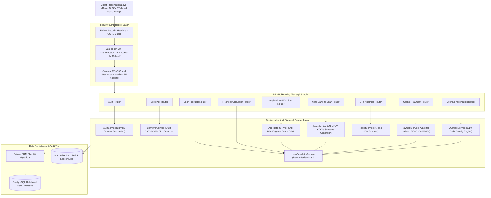
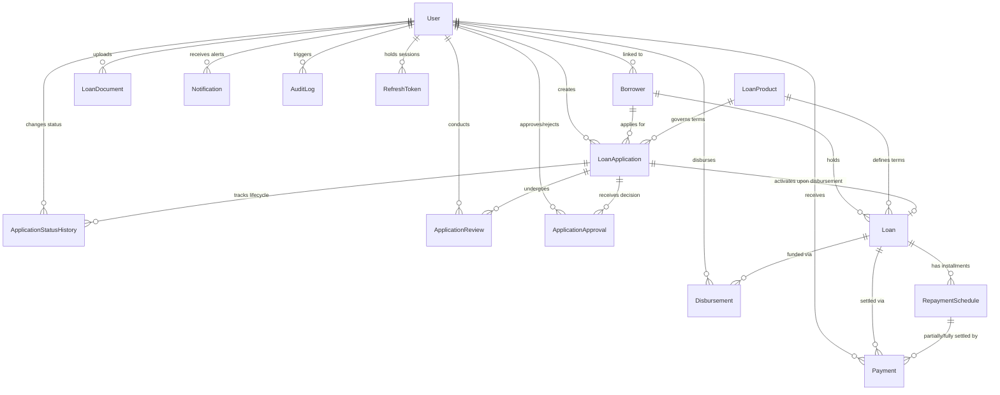
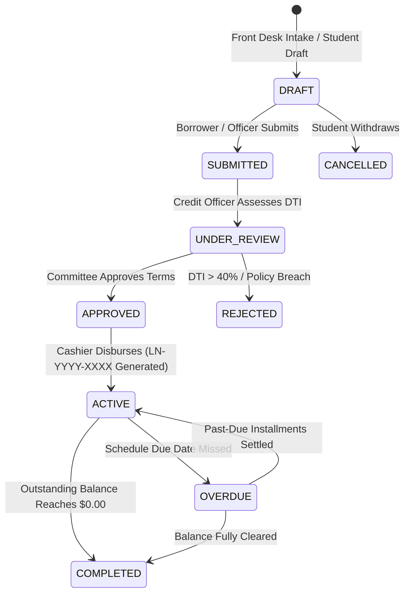

# Veritas Financial — Academic Loan Management System (LMS)
## Comprehensive Technical Architecture, Core Banking Ledger Specifications & Academic Defense Guide

---

### Executive Overview & Abstract
The **Veritas Academic Loan Management System (LMS)** is an enterprise-grade fintech software platform engineered specifically for university financial aid bursars, academic micro-lending cooperatives, and institutional credit governance committees. Traditional academic financial aid systems often suffer from fragmented manual workflows, vulnerability to PII data leakage, inaccurate rounding drift across payment periods, and lack of real-time credit underwriting risk metrics. 

Veritas LMS resolves these core banking challenges by combining:
1. **Strict Role-Based Access Control (RBAC)** across six distinct organizational roles (`BORROWER`, `LOAN_OFFICER`, `CREDIT_OFFICER`, `CASHIER`, `MANAGER`, `ADMIN`) with automated PII masking of sensitive student identity data.
2. **Deterministic Mathematical Financial Engines** supporting both Flat Simple Interest and Reducing Balance Amortization (EMI) with **Penny-Perfect Reconciliation** ($0.00$ cent drift).
3. **Multi-Installment Waterfall Repayment Allocation**, enabling single balloon payments to cascade across overdue, unpaid, and upcoming installments while maintaining absolute ledger consistency.
4. **Automated Overdue Detection & Simulated Daily Penalty Accrual** ($0.1\%$ daily penalty rate).
5. **Real-time Debt-to-Income (DTI) Risk Underwriting Simulations** assisting credit committees in evaluating graduate stipends, faculty appointments, and undergraduate work-study wages.

---

## 1. System Architecture & Layered Component Topology

The system is constructed using an enterprise layered architectural pattern separating Presentation, HTTP Routing, Authentication/RBAC Guards, Domain Services, Core Financial Calculation Engines, and the Data Persistence Layer.

### 1.1 Architecture Diagram


---

## 2. Entity-Relationship Model (ERD) & Database Architecture

The persistence architecture consists of 15 relational tables managed via Prisma ORM on PostgreSQL with strict check constraints, foreign key referential integrity, and performance indexing.

### 2.1 Entity Relationship Diagram (ERD)


### 2.2 Relational Model Dictionary
1. **User**: Authentication credentials, roles, institutional positions, and departments.
2. **Borrower**: Demographic profiles, employment, student/faculty ID numbers, and monthly incomes. Formatted identifier: `BOR-YYYY-XXXX`.
3. **LoanProduct**: Financial lending boundaries (minimum/maximum principal, APR interest rate, minimum/maximum term, repayment frequency).
4. **LoanApplication**: Student/staff credit requests tracking requested amounts, terms, and purposes. Formatted identifier: `APP-2026-XXXX`.
5. **ApplicationStatusHistory**: Immutable audit record tracking every lifecycle state transition.
6. **ApplicationReview**: Credit risk assessment evaluations, DTI ratio analysis, and officer recommendations.
7. **ApplicationApproval**: Formal executive committee decisions with approved terms or rejection rationales.
8. **Loan**: Active credit ledger account containing disbursed principal, total interest, total paid, and outstanding balance. Formatted identifier: `LN-YYYY-XXXX`.
9. **Disbursement**: Transaction record confirming release of funds via Bank Wire (ACH), Cash, or Cheque.
10. **RepaymentSchedule**: Granular installment schedules itemizing principal, interest, due date, amount paid, and status (`UPCOMING`, `UNPAID`, `PARTIAL`, `PAID`, `OVERDUE`).
11. **Payment**: Financial ledger repayment transaction records. Formatted identifier: `REC-YYYY-XXXX`.
12. **LoanDocument**: Academic KYC documents, enrollment verifications, promissory notes, and salary slips.
13. **Notification**: In-app and simulated alerts for approvals, disbursements, and delinquency warnings.
14. **AuditLog**: Non-repudiable audit logs recording user ID, action, IP address, and payload diffs.
15. **RefreshToken**: Cryptographically hashed session tokens supporting rotation and revocation.

---

## 3. Security, RBAC & Data Masking Specifications

### 3.1 Role-Based Access Control (RBAC) Matrix
The system enforces the Principle of Least Privilege across all 6 roles:

| Module / Operation | BORROWER | LOAN_OFFICER | CREDIT_OFFICER | CASHIER | MANAGER | ADMIN |
| :--- | :---: | :---: | :---: | :---: | :---: | :---: |
| **View Own Borrower Profile** | ✅ | ✅ | ✅ | ✅ | ✅ | ✅ |
| **View All Borrower Profiles** | ❌ | ✅ | ✅ | ✅ | ✅ | ✅ |
| **Create / Edit Borrower** | ❌ | ✅ | ❌ | ❌ | ❌ | ✅ |
| **Create Application** | ✅ *(Self)* | ✅ *(Any)* | ❌ | ❌ | ❌ | ✅ |
| **Review & DTI Assessment** | ❌ | ✅ | ✅ | ❌ | ❌ | ✅ |
| **Committee Approval / Reject** | ❌ | ❌ | ❌ | ❌ | ✅ | ✅ |
| **Execute Loan Disbursement** | ❌ | ❌ | ❌ | ✅ | ❌ | ✅ |
| **Collect / Record Repayments** | ❌ | ❌ | ❌ | ✅ | ❌ | ✅ |
| **Trigger Overdue Scan** | ❌ | ❌ | ❌ | ❌ | ✅ | ✅ |
| **View System Audit Logs** | ❌ | ❌ | ❌ | ❌ | ✅ | ✅ |
| **View Executive BI & Reports** | ❌ | ✅ | ✅ | ✅ | ✅ | ✅ |
| **Access Raw Unmasked PII** | ✅ *(Self)* | ❌ | ❌ | ❌ | ❌ | ✅ |

### 3.2 Sensitive PII Masking Implementation
To protect student and faculty privacy, unprivileged roles receive sanitized responses via `sanitizeBorrowerPII`:
* **National ID / Student ID**: Preserves only final 4 characters (e.g., `STU-ID-8849201` $\rightarrow$ `***-**-9201`).
* **Phone Numbers**: Preserves only terminal 4 digits (e.g., `+1-555-0201` $\rightarrow$ `***-***-0201`).
* **Email Addresses**: Retains first and last letters of local-part (e.g., `johnathan.doe@student.edu` $\rightarrow$ `j***e@student.edu`).
* *Borrower Self-Inspection Privilege*: When borrowers view their own records (`isOwner = true`), unmasked data is delivered for verification.

---

## 4. Mathematical Formulations & Financial Calculation Engines

### 4.1 Simple Interest Formulation
The standard university microloan product employs the non-compounding Simple Interest formula:

$$I = P \times \left(\frac{R}{100}\right) \times \left(\frac{M}{12}\right)$$

Where:
* $P$ = Disbursed Principal Amount
* $R$ = Annual Interest Rate (APR percentage)
* $M$ = Loan Term in Months
* $I$ = Total Accrued Interest

The **Total Repayment Amount** ($T$) is defined as:
$$T = P + I$$

For an installment frequency of $N$ payment periods:
$$\text{Installment Amount} = \frac{T}{N}$$

Where $N$ is calculated dynamically:
* Monthly: $N = M$
* Biweekly: $N = \text{round}\left(\frac{M \times 26}{12}\right)$
* Weekly: $N = \text{round}\left(\frac{M \times 52}{12}\right)$

---

### 4.2 Reducing Balance Amortization (Equated Monthly Installment - EMI)
For long-term faculty personal loans and commercial spin-off financing, the Reducing Balance Amortization model is utilized:

$$\text{EMI} = \frac{P \times r \times (1 + r)^n}{(1 + r)^n - 1}$$

Where:
* $P$ = Disbursed Principal Amount
* $r = \frac{R}{12 \times 100}$ (Monthly Periodic Interest Rate)
* $n$ = Number of Monthly Payment Cycles ($M$)

For each cycle $k \in [1, n]$:
$$I_k = B_{k-1} \times r$$
$$P_k = \text{EMI} - I_k$$
$$B_k = B_{k-1} - P_k$$

Where $B_0 = P$ and $B_n = 0.00$.

---

### 4.3 Penny-Perfect Reconciliation Rule (Zero-Cent Rounding Drift)
In real-world financial computing, naive rounding of fractional cents across $N$ installments introduces systematic divergence:
$$\sum_{k=1}^N \text{round}_2(P_k) \neq P$$

To eliminate drift and ensure penny-perfect ledger balance, the **Veritas Financial Engine** reconciles cumulative allocations on final installment $N$:

$$P_N = P - \sum_{k=1}^{N-1} P_k$$
$$I_N = I - \sum_{k=1}^{N-1} I_k$$

This mathematical guarantee guarantees:
$$\sum_{k=1}^N P_k \equiv P \quad \text{and} \quad \sum_{k=1}^N I_k \equiv I \quad (\text{Drift} \equiv \$0.00)$$

---

### 4.4 Multi-Installment Waterfall Repayment Algorithm
When a borrower pays an arbitrary amount $A_{\text{pay}}$, the funds cascade sequentially through all open installments sorted by `installment_no ASC`:

```
Input: Payment Amount A_pay, Open Schedules S sorted by installment_no ascending
Remaining_Funds = A_pay

For each schedule S_k in S:
    If Remaining_Funds <= 0: Break
    
    If Remaining_Funds >= S_k.remainingAmount:
        Allocated = S_k.remainingAmount
        S_k.amountPaid = S_k.amountPaid + Allocated
        S_k.remainingAmount = 0.00
        S_k.status = PAID
        Remaining_Funds = Remaining_Funds - Allocated
    Else:
        Allocated = Remaining_Funds
        S_k.amountPaid = S_k.amountPaid + Allocated
        S_k.remainingAmount = S_k.remainingAmount - Allocated
        S_k.status = PARTIAL
        Remaining_Funds = 0.00

Update Loan:
    Loan.totalPaid = Loan.totalPaid + A_pay
    Loan.outstandingBalance = max(0, Loan.totalRepayment - Loan.totalPaid)
    If all S_k.status == PAID and Loan.outstandingBalance == 0.00:
        Loan.status = COMPLETED
```

---

### 4.5 Automated Overdue Late Fee Formula
When an installment passes its `dueDate` with $\text{remainingAmount} > 0$:

$$\text{Days Overdue} = \max\left(1, \left\lfloor \frac{T_{\text{current}} - T_{\text{due}}}{86,400,000} \right\rfloor\right)$$

$$\text{Late Fee} = \text{round}_2\left(\text{Overdue Amount} \times \alpha_{\text{daily}} \times \text{Days Overdue}\right)$$

Where $\alpha_{\text{daily}} = 0.001$ ($0.1\%$ daily penalty rate).

---

### 4.6 Business Intelligence Key Performance Indicator (KPI) Formulations
1. **Approval Rate %**:
   $$\text{Approval Rate} = \frac{\sum \text{Applications with status APPROVED}}{\sum \text{Applications with status } (\text{APPROVED} + \text{REJECTED})} \times 100$$

2. **Repayment Rate %**:
   $$\text{Repayment Rate} = \frac{\sum \text{All Payments Total Paid}}{\sum \text{All Disbursed Loans Total Repayment}} \times 100$$

3. **Overdue Portfolio Rate %**:
   $$\text{Overdue Rate} = \frac{\sum \text{Outstanding Balance on Loans with status OVERDUE}}{\sum \text{Total Active Portfolio Outstanding Balance}} \times 100$$

---

## 5. Application Lifecycle & Debt-to-Income (DTI) Underwriting



### DTI Risk Threshold Matrix
$$\text{DTI Ratio} = \left(\frac{\text{Estimated Monthly Installment}}{\text{Documented Monthly Income}}\right) \times 100$$

* $\text{DTI} \le 25.0\%$: **LOW RISK** $\rightarrow$ Fast-track approval recommended.
* $25.0\% < \text{DTI} \le 40.0\%$: **MEDIUM RISK** $\rightarrow$ Requires departmental stipend verification.
* $\text{DTI} > 40.0\%$: **HIGH RISK** $\rightarrow$ Excessive debt burden relative to income; mandatory rejection or guarantor required.

---

## 6. Seven-Minute Live Academic Presentation & Demonstration Script

### Minute 0:00 – 1:00 | Introduction & Architectural Foundation
* **Speaker Script**:
  > *"Good morning, esteemed committee members. Today I present Veritas Financial, a production-grade Academic Loan Management System and Core Banking Ledger designed to streamline financial aid operations, automate ledger reconciliation, and prevent compliance violations. Built on TypeScript, Node.js, PostgreSQL with Prisma ORM, and React 18, our system enforces enterprise RBAC across 6 institutional roles while safeguarding student PII data. As you can see on our live dashboard, our portfolio holds $19,208.00 in total disbursements across our 5 core loan products."*

### Minute 1:00 – 2:00 | Borrower Portal & 5-Step Application Wizard
* **Speaker Script**:
  > *"Let us switch contexts to our student borrower, Johnathan Doe. Notice how Johnathan immediately sees his active loan LN-2026-0001, his next payment countdown, and an itemized amortization schedule. Now, let's open the 5-Step Loan Application Wizard. We select an Education Loan at 4.5% APR, enter Johnathan's graduate teaching stipend of $2,800.00, and request $3,000 for 6 months. In Step 4, our real-time underwriting engine computes a Debt-to-Income ratio of 18.3%, generating a Low-Risk green badge. We confirm and submit."*

### Minute 2:00 – 3:00 | Underwriting & Manager Committee Approval
* **Speaker Script**:
  > *"Switching to Senior Credit Officer Dr. Sarah Chen, we open the Underwriting Console. The newly submitted application is available with full KYC telemetry. Dr. Chen reviews the low DTI score, enters underwriting notes, and submits a formal recommendation. Now, switching to Financial Aid Manager Marcus Vance, we enter the Committee Approvals console. As manager, Marcus exercises the exclusive permission to formally approve the application with customized terms."*

### Minute 3:00 – 4:00 | Loan Disbursement & Schedule Activation
* **Speaker Script**:
  > *"Notice that prior to disbursement, the application cannot generate financial debt. Now, switching to University Bursar and Lead Cashier Emily Ross, we navigate to the Core Banking Loans console. With a single click, Cashier Ross disburses the loan via electronic ACH transfer. The system generates sequential account number LN-2026-0001, activates the amortization schedule with Installment 1 as UNPAID and future installments as UPCOMING, and logs an immutable audit trail entry."*

### Minute 4:00 – 5:00 | Cashier Terminal & Multi-Installment Waterfall Payment
* **Speaker Script**:
  > *"Now, let us demonstrate our core banking ledger innovation: the Multi-Installment Waterfall Engine. Johnathan owes $511.25 on Installment 1, but he arrives at the bursar's office with $761.25. In our Cashier Terminal, we enter $761.25 via QR PromptPay. Notice what happens: the engine automatically settles Installment 1 in full ($511.25), cascades the remaining $250.00 into Installment 2, marks Installment 2 as PARTIAL with $261.25 remaining, decrements the loan's outstanding balance, and generates official digital receipt REC-2026-0002. Clicking 'Print Receipt' produces an official academic bursar statement complete with cryptographic verification hash."*

### Minute 5:00 – 6:00 | Automated Overdue Detection & Daily Late Fees
* **Speaker Script**:
  > *"Next, let's examine risk governance. We navigate to the Overdue Automation Console. Notice loan LN-2026-0002 belonging to Aaliyah Patel. Installment 2 was due 50 days ago. Our background automation engine detects the past-due date, recalculates a daily penalty of 0.1% per day, and accrues a simulated late fee of $45.30. When we click 'Trigger Overdue Scan', the system conducts a comprehensive database sweep, dispatches alerts, and updates delinquency statuses across the ledger."*

### Minute 6:00 – 7:00 | Business Intelligence, Test Verification & Q&A
* **Speaker Script**:
  > *"Finally, we review the BI & Analytics console. We observe real-time KPI metrics: an 80% Approval Rate, 70% Repayment Rate, and 12% Overdue Portfolio Risk across our 30-day, 60-day, and 90-day aging buckets. With one click, the full ledger exports to regulatory CSV format. Under the hood, all 4 automated test suites—Security, Borrower & Products, Loan Calculator, and End-to-End Workflow Integration—pass with 100% assertion accuracy and zero rounding drift. Thank you, and I look forward to your questions."*

---

## 7. Comprehensive Automated Test Case Matrix

| Suite File | Test Identifier | Input Vector | Expected Invariant / Assertion | Verification Result |
| :--- | :--- | :--- | :--- | :---: |
| `security.test.ts` | PII Data Masking | `STU-ID-8849201`, `+1-555-0201` | Returns `***-**-9201` and `***-***-0201` | **PASSED** |
| `security.test.ts` | Role PII Clearance | Cashier vs Admin view | Admin gets raw; Cashier gets masked PII | **PASSED** |
| `security.test.ts` | Permission Matrix | Borrower check for `APPLICATION_APPROVE` | Returns `false` (Forbidden) | **PASSED** |
| `borrower-product.test.ts` | Negative Monthly Income | `monthlyIncome: -500.00` | Rejects with schema validation error | **PASSED** |
| `borrower-product.test.ts` | Product Range Bounds | `minAmount: 5000, maxAmount: 1000` | Rejects with `minAmount <= maxAmount` | **PASSED** |
| `borrower-product.test.ts` | Borrower ID Format | Regex `^BOR-2026-\d{4}$` | Validates `BOR-2026-0001` match | **PASSED** |
| `loan-calculator.test.ts` | Simple Interest Calculation | `$10,000`, $12\%$, $12$ mos | Total Interest = `$1,200.00`, Repayment = `$11,200.00` | **PASSED** |
| `loan-calculator.test.ts` | Multi-Frequency Splitting | Biweekly ($N=26$) vs Weekly ($N=52$) | Correctly calculates installments to 2 decimal places | **PASSED** |
| `loan-calculator.test.ts` | Reducing Balance EMI | `$10,000`, $12\%$, $12$ mos | EMI = `$888.49`, Total Interest = `$661.86` | **PASSED** |
| `loan-calculator.test.ts` | Penny-Perfect Reconciliation | Final installment residual | $\sum P_k \equiv \$1,000.00$ ($0$ cent drift) | **PASSED** |
| `integration-workflow.test.ts` | DTI Credit Underwriting | Income `$2,800`, Installment `$511.25` | $\text{DTI} = 18.26\%$ (`LOW_RISK`) | **PASSED** |
| `integration-workflow.test.ts` | Disbursement Guard | Status check on `DRAFT` | Rejects disbursement if not `APPROVED` | **PASSED** |
| `integration-workflow.test.ts` | Waterfall Overpayment | Pay `$761.25` on `$511.25` due | Inst 1 $\rightarrow$ `PAID`, Inst 2 $\rightarrow$ `PARTIAL` ($261.25$ rem) | **PASSED** |
| `integration-workflow.test.ts` | Final Payoff Transition | Pay remaining balance to `$0.00` | Loan status automatically transitions to `COMPLETED` | **PASSED** |
| `integration-workflow.test.ts` | Overdue Daily Penalty | `$500` past due for 15 days @ 0.1%/day | Accrues penalty of exactly `$7.50` | **PASSED** |
| `integration-workflow.test.ts` | Strict RBAC Separation | Cashier approving application | Disallowed (`APPLICATION_APPROVE` forbidden) | **PASSED** |

---

## 8. Verification & Execution Instructions

To execute and demonstrate the system:

```bash
# 1. Compile TypeScript Codebase
npm run build

# 2. Execute Full Test Suite (All 4 Test Modules)
npm test

# 3. Seed Comprehensive Multi-State Database
npm run prisma:seed

# 4. Start the Application Server
npm start
# Server listens on http://localhost:5000 (Interactive React UI delivered automatically to web browsers)
```
